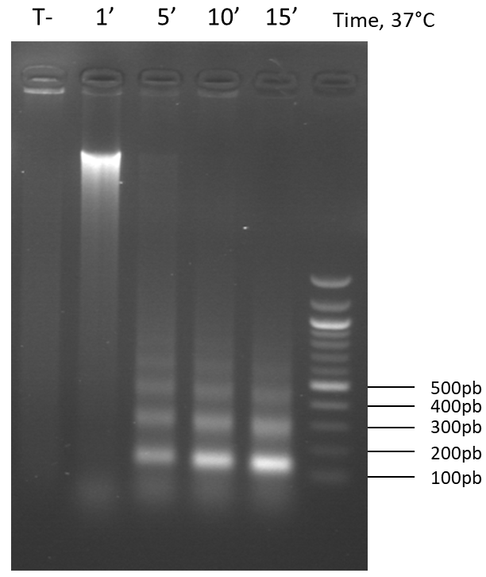

---
output:
  word_document: default
  html_document: default
---
# ChIP protocol

## Preparation of mycelium

Culture
- Inoculate 6 Roux bottles of 100 ml of medium with a fresh mycelium (grown 1 or 2 days on M2 medium at 27°C).
- Incubate 62 hours in the dark at 27°C.

Fixation
- Filter the mycelium on gauze, rinse once with PBS at room temperature.
- Fix in 100ml of PBS 1X + 2.5 ml Formaldehyde 37%, shake 15 min at 27°C. 
- Stop with 2.5 ml of Glycine 2.5 M (shake for 5 min).

Grinding and storage (In cold room)
- Filter the mycelium and wash twice with cold PBS
- Dry on wattman paper (do not hesitate to press the mycelium)
- Grind with liquid nitrogen with mortar and pestle. 
- Weigh and store at -80°C in 50 mL Falcon tubes (transport in liquid nitrogen).

 

### Day 1

Lysis and chromatin digestion 

- In the cold room : Weigh approximately 200 mg of mycelium (cool the spatula in liquid nitrogen before each sample, no more than 2 samples after removal of the mycelium from liquid nitrogen)
- In the ice: Resuspend the mycelium with 1 mL of [Lysis buffer](Lysis_Buffer.md) (+proteinase inhibitor + CaCl2)
- Mix well 10 times going back and forth with the P1000, vortex, leave 10 min on ice, vortex again.
- Add 5μl of Micrococcale Nuclease and incubate 20-30 min at 37°C (in the water bath) (+ a control without MNase to check digestion), 
- Gently mix the tubes every 2 min to resuspend the mycelium.
- Stop the reaction with 30 μl of EGTA pH 8 0.5 M , incubate 5 min on ice.

- Centrifuge 3-5 min at 4°C at top speed, 
- Recover the supernatant (= soluble chromatin), 
- Repeat the centrifugation to remove as much as possible the undigested genomic DNA.

(Possibility of Storing -80 ° C at this stage, but for the CHIP it is better to avoid the thawing steps and chain).

Checking the nucleosomal scale (on a 50 µl aliquot):

* Treat with:
     + RNAse A (20mg/ml) 10 μl, 60 min at 37°C
     + Proteinase K (20mg/ml) 10 μl, 120 min at 65°C
     + SDS 0.5% 65°C over night (=decrosslink)

### Day 2

* Phenol extraction:

     + 300μl phenol
     + 300μl chloroform 
     + mix or vortex, 
     + centrifuge 3 min at top speed
     + recover the aqueous phase
     + 600 μl chloroform
     + centrifuge 3 min at top speed
     + recover the aqueous phase

* Ethanol precipitation:

     + 1/100 glycogen
     + 1/10 Sodium Acetate 3 M
     + Ethanol 100% x2.5 (DNA+ Na Acetate) or fill the tube
     + Centrifuge 10 min 16000G, 4°C, remove supernatant
     + 500 μl cold ethanol 70% 
     + Centrifuge 10 min 16000G, 4°C, remove supernatant
     + Air dry 10-20 min
     + Resuspend in 50 μl H2O, 
     + Run a gel with 10μl of sample + 2μl of loading buffer, 40 min 50V 1.5% agarose

It should looks like this:

 

 

 

 

## ChiP:

- Quantify the chromatin (with Qbit)
- Add 1.1 ml of [Lysis buffer](Lysis_Buffer.md) + protease inhibitor to 5 μg of chromatin

In the cold room:

- Washing: add 30 μl of magnetic beads,  incubate 3-4h at 4°C on a rotating wheel.
- Place the tubes on a magnetic rack and recover the supernatant
- Take 100 μl (= Input) and freeze at -80°C
- Incubate the rest (1 ml) with the antibody over night at 4°C on a rotating wheel, **do not forget a sample without Antibodies (Ac0)**

 

**Caution**: 1 Tube (5μg) = 1 Precipitation with 1 antibody. Prepare 1 tube for each replicate of each antibody.

 

### Day 3

Incubation with beads, Washing, Elution and Decrosslink

- Add 20μl of magnetic beads, incubate 4h at 4°C on a rotating wheel

- Washes: on magnetic rack for 3 min, remove supernatant, add 1 ml of buffer and incubate 10 min on rotating wheel each time
    1. [Lysis buffer](Lysis_Buffer.md) without protease inhibitor without CaCl2 - x2
    2. [Lysis buffer NaCl](Lysis_Buffer_500.md)
    3. [LiCl Washbuffer](LiCl_Buffer.md) - x2
    4. Tris-EDTA
  

- Elution: resuspend the beads in 62.5μl of [TES](TES.md) preheated at 65°C and incubate at 65°C (vortex every 2 min or shake with the thermomixer)
    - Recover the supernatant and repeat the elution with fresh TES, pool the two elutions --> Samples

- Reverse crosslink:  Add 500 μl of TES to Inputs and incubate Samples and Inputs at 65°C over night

### Day 4

RNase, Proteinase, Phenol/Chlo Purification

- Add 125 μl H2O to the Samples

* Treat with:

     + RNAse A (20mg/ml) **2 μl for the Samples, 5 µl for the Inputs**, 120 min at 50°C
     + Proteinase K (20mg/ml) 10 μl, 120 min at 50°C
     + SDS 0.5% 65°C over night (=decrosslink)
     
* Phenol extraction:

     + 300μl phenol
     + 300μl chloroform 
     + mix or vortex, 
     + centrifuge 3 min at top speed
     + recover the aqueous phase
     + 600 μl chloroform
     + centrifuge 3 min at top speed
     + recover the aqueous phase

* Ethanol precipitation:

     + 1/100 glycogen
     + 1/10 Sodium Acetate 3 M
     + Ethanol 100% x2.5 (DNA+ Na Acetate) or fill the tube
- Precipitate overnight at 4°C
 

### Day 5

 
* Ethanol precipitation (end):

     + Centrifuge 10 min 16000G, 4°C, remove supernatant
     + Air dry 10-20 min
     + Resuspend in 30μl of Tris-EDTA 

- Quantify the chromatin with the Qubit high sensitivity
- Freeze at -80°C
