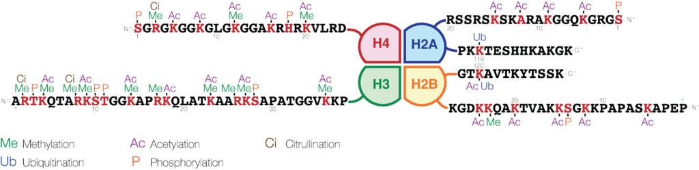

# Introduction to Epigenomics

## There are many different definitions of epigenetics
The one used for the course is the following : Epigenetics is the study of mitotically and/or meiotically _heritable_ (but _reversible_) changes in gene/genome function that _cannot be explained by changes in DNA sequence_ and persist in the absence of the factors that induce these changes.

The covalent modification of DNA (through DNA methylation) and of histone proteins (through acetylation, methylation, phosphorylation, ubiquitination, sumoylation… of specific amino-acid residues), play essential role in the activation/repression of certain genes. This thereby modulates the cell phenotypes.

## Histone post-translational modification are of important relevance for this practical course
Many lysine residues of histone tails can be acetylated. The addition of the acetyl group neutralizes the positive charge of lysine radicals, which diminishes interactions with the negatively-charged DNA. Consequently, histone acetylation is usually associated with open, transcriptionally active chromatin. 
Histones tails can also be methylated, with different outcomes depending on which lysine residue is methylated and how many methyl-groups are added to the lysine.  Methylation of the lysines 4 and 36 of histone H3 are seen in euchromatin, with H3K4me3 being found at active promoter and H3K36me3 being enriched in the body of actively transcribed genes. On the contrary, H3K27me3 and H3K9me3 are found in the heterochromatic, transcriptionally-silent regions of the chromosomes.

|  |
|:--:|
|<b>Figure -  Schematic representation of histone modifications.</b>   Source: wikipedia.org|

The modulation of the histone post-translational modification content at specific genomic regions represent **classical epigenetic regulatory mechanisms**. This is natural and essential to many organism functions (cellular differentiation, lineage commitment, modulation of gene expression, ...). In cases of improper occurrence, this can have major adverse consequences (developmental disorders, cancers, ...).

## Epigenomics

**The epigenomics** is the study of the complete set of epigenetics modifications on the genetic material of a cell or organism, with no or little need for mitotic/meiotic inheritance of the epigenetic marks. It heavily relies on (1) the ability to generate big data (initially though micro-arrays, but now via Massive Parallel Sequencing) and (2) on the ability to analyze and comprehend using bioinformatic tools.

