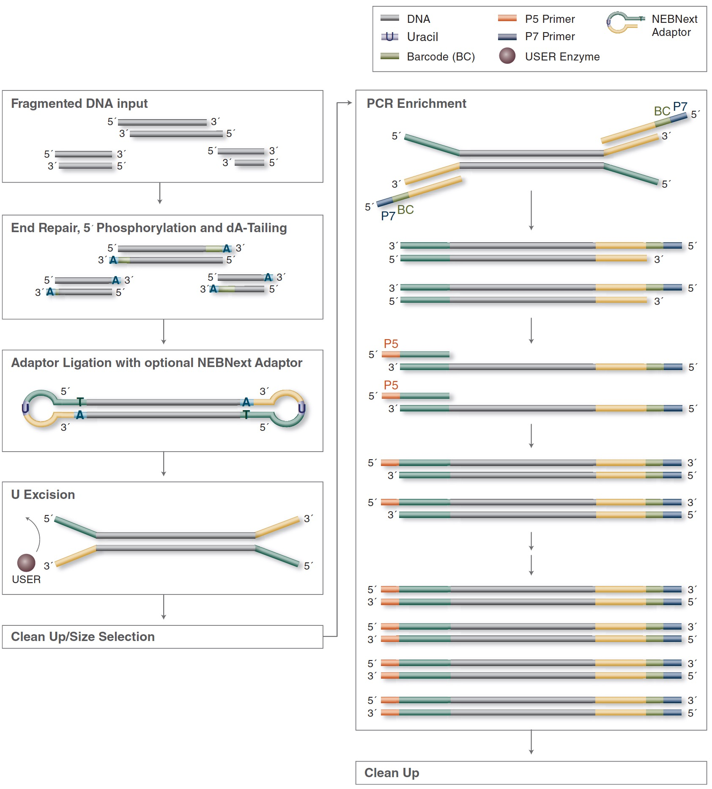

# Library Preparation

Once the IP quality has been validated, the ChIP material is converted into an Illumina Sequencing library. This is done using the NEBNext Ultra II DNA Library Prep Kit for Illumina (NEB #E7645S/L).

## Prior consideration

- ChIP’ed material should be in volume of 50 µL 10mM Tris-HCl pH8.0 and be in a PCR tube
- For the input: use 40-50 ng
- For the IP material, use the whole sample (usually a few ng). If the QuBit did not permit the quantification of the ChIP material (concentration too low), it can still be converted into a sequencing library, provided that the qPCR validations are OK.

|<b>Figure -  Overview of the library Preparation protocol</b>   Source: https://international.neb.com|
|:--:|
|  |

## End-repair
1. Adjust the volume of the IPs and Input material to a total volume of 50µL with 10mM Tris-HCl pH8.0, then add:
	- 🍏(green) 3µL NEBNext UltraII End Prep Enzyme Mix
	- 🍏(green) 7µL NEBNext UltraII End Prep Reaction Buffer

2. Set a 200µL pipette to 50µL and then pipette the entire volume up and down at least 10 times to mix thoroughly.

3. Perform a quick spin in a mini centrifuge

4. Place tubes in a PCR machine and run the following program, with the lid set at ≥ 75°C
	- 30 min at 20°C
	- 30 min at 65°C
	- hold 4°C

*STOP point: If necessary, samples can be stored at -20°C; however, a slight loss in yield (~20%) may be observed. NEB recommends continuing with adaptor ligation before stopping*   

## Adapter ligation

**Beforehand**: Dilute the "NEBNext Adaptor for Illumina" with the adaptor dilution buffer (10mM Tris pH8.0, 10mM NaCl) as recommended in the table below:

| DNA quantity   | Adaptor Dilution  | Working adaptor concentration  |
|---             |---                |---                             |
| 1µg - 100ng    |   No dilution     |   15µM                         |
| 100ng - 5ng    |   10-fold (1:10)  |   1.5µM                        |
| less than 5ng  |   25-fold (1:25)  |   0.6µM                        |

_NB: The "NEBNext Adaptor for Illumina" is provided in the Multiplex Oligo kit (7335S et 7500S)_

2. Mix the 🔴(red) NEBNext Ultra II Ligation Master Mix by pipetting up and down several times

2. To the 60µL End-repaired material, add the following:
	-  🔴(red) 30µL NEBNext Ultra II Ligation Master Mix
	-  🔴(red) 1µL NEBNext Ligation Enhancer
	-  🔴(red) 2.5µL (diluted) NEBNext Adaptor for Illumina

7. Set a 200µL pipette to 50µL and then pipette the entire volume up and down at least 10 times to mix thoroughly. Caution, the Ligation Master Mix is very viscous.

8. Quickly spin in a mini centrifuge

9. Incubate 20 min at 20°C in PCR machine (with the LID OFF)

10. Add 🔴(red) 3µL USER Enzyme to the ligation mixture. _NB: The "USER enzyme" is provided in the Multiplex Oligo kit_

11. Mix well by gentle pipetting up and down at least 10 times

12. Perform a quick spin in a mini centrifuge

13. Place tubes in PCR machine and incubate for 20 min at 37°C with the LID set at > 47°C.

*STOP point: samples can be stored overnight at -20°C*   

## Clean-UP using Ampure XP beads

14. Warm the **Ampure XP beads** to room temperature for 30 min. Prepare fresh 80% EtOH. Transfer the adaptor ligated material to a 1.5mL DNA LoBind Eppendorf microtube.

15. Mix the beads well by vortexing (> 10s) and precisely add 0.9 volume (= 87µL) of Ampure XP beads to adapter ligated material
16. Mix by pipetting up and down at least 10 times followed by vortexing
17. Incubate 5 min at RT

18. Quickly spin in a mini centrifuge / normal centrifuge
19. Place tubes on magnetic particle separator.
20. After 5 minutes (or when the solution is clear) discard the supernatant

21. Keep tubes on magnet and add 200µL freshly prepared 80% EtOH to the beads
22. Incubate 1 min at RT while the tubes are still on the magnetic rack
23. Discard supernatant. Do not disturb the beads

24. Keep tube on magnet and add again 200µL 80% EtOH
25. Incubate 1 min at RT.
26. Discard supernatant. Do not disturb the beads.

27. Do a short spin (2-3 sec), then place the tube on magnet and aspirate remaining EtOH with a p20. Leave the tube on magnet for 30 sec (lid open to air-dry). Proceed to the following step (= elution) when the beads are still dark brown and glossy looking (and all liquid has evaporated). When the beads turn lighter brown and start to crack, they are too dry and the elution becomes inefficient.

28. Remove the tube from magnet and quickly add 16µL Bottled water.
29. Mix by pipetting up and down at least 10 times.
30. Incubate 2 min at RT.

31. Quickly spin the tube
32. Place tube on magnetic particle separator for 5min at RT
33. Transfer 15µL of the supernatant to a fresh PCR tube. Avoid taking beads at all cost.

*Samples can be stored at -20°C.*

## PCR amplification

*Prior starting: plan the experiment to use a unique index for all the libraries that will be sequenced together*

34. Add to the 15µL cleaned-up adapter ligated material the following:
	- 🔵(blue) 25µL NEBNext Ultra II Q5 Master Mix
	- 🔵(blue) 5µL Index 10µM primer
	- 🔵(blue) 5µL Universal 10µM PCR primer

35. Set a 200µL pipette to 40µL and then pipette the entire volume up and down at least 10 times to mix thoroughly. Quickly spin in a mini-centrifuge.

36. Place tubes in PCR machine and run the following program
	- 30 sec  @ 98°C
	- 10 sec  @ 98°C |
	- 30 sec  @ 65°C |  x (7 - 12 cycles)   [_NEB now says anneal+extension 75sec @ 65°C_]
	- 30 sec  @ 72°C |
	- 5 min   @ 72°C
	- hold 4°C

	>The number of cycles depends on the starting quantity. 
	
	>- If starting with 5ng, do 12 cycles
	- If starting with 10ng, do 11 cycles
	- If starting with 20ng, do 10 cycles
	- If starting with 50ng, do 8 cycles

	
## Clean up of PCR amplified library

Clean up the PCR amplified library using Ampure XP beads.
Two procedures can be followed. Do either one or the other.

a- Purification without size selection. To do so, add 1 volume of Ampure XP beads the the PCR amplified material and follow the procedure done for the purification of Adapter-Ligated material. Elute in 20µL.

b- Purification with size selection. To do so, place 100 ng of PCR amplified material in a new DNA LoBind tube and adjust the volume to 50µL with H2O. Then, do a double-size selection (0.6X - 0.9X). Elute in 12µL.

## Quantification

Quantify 2µL of cleaned-up material using QuBit dsDNA HS kit. Follow the procedure shown in the [QuBit](QuBit.md) section.

