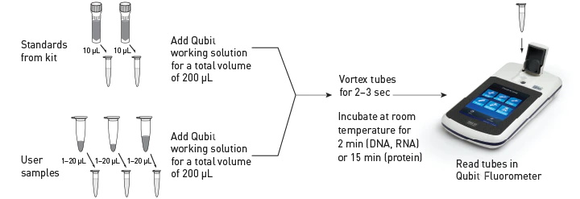

# QuBit Dosage

The QuBit fluoromoters can detect and measure fluorescent dyes that are specific to either protein, RNA, single-stranded DNA or double-stranded DNA. For this practical, we will only use the **QuBit dsDNA DNA High Sensitivity (HS) kit** that is highly selective for double-stranded DNA.

## Range of detection

The fluorescent reading is done in special 500 µL assay tubes. 

The DNA quantity in the assay tube should be lower than 100 ng for the QuBit dsDNA HS kit. Consequently, samples may need to be diluted beforehand.

## Protocol for dosage:

### Label the QuBit Assay tubes

One assay tube is needed per sample + 2 tubes for the two standards. Label them.

|<b>Figure -  QuBit Workflow</b>   Source: https://www.thermofisher.com|
|:--:|
|  |

### Prepare the QuBit Working solution

- If you are using the Qubit 1X dsDNA HS Assay Kits, the working solution is ready-to-use

- If you are using other kits, you have to prepare the working solution before the measurements

	- Prepare the Qubit working solution by diluting (in an eppendorf or a falcon tube) the Qubit dsDNA HS Reagent 1:200 in Qubit dsDNA HS Buffer. 

	- 200µL of working solution are needed per measurement. 2 standard are needed for a serie of measurements. So, if 8 samples need to be measured, prepare enough working solution for 10x200µL (+ 10% extra)

### Prepare the standard measurements

- Vortex the two standard solutions.
- Add 190µL QuBit Working solution to two assay tube.
- Add 10µL Standard 1 to one of the tube
- Add 10µL Standard 2 to the other tube

### Prepare the sample measurements

- Vortex the samples
- Add QuBit working solution to the assay tube so that the final volume in each tube is 200µL
- Add your sample. Your sample can be anywhere from 1-10µL. Measuring 2µL is  classical.

### To the standard and samples

- Vortex the assay tubes containing the standard or the sample
- Incubate at room temperature for 2 minutes. The fluorescence is stable for 1hr. Leave in the dark if incubating > 10min.
- Proceed to "Reading the standard and samples"
	+ On the Home screen, press DNA, then dsDNA
	+ Do the calibration with the two standards (starting with Standard #1, then Standard #2)
	+ Once calibration is completed, measure the concentration in your sample one by one (you might need to indicate the volume of sample you used).
	+ Careful: the given concentration is the concentration in the assay tube, not of your actual sample. Take any intermediate dilution into account.
	

