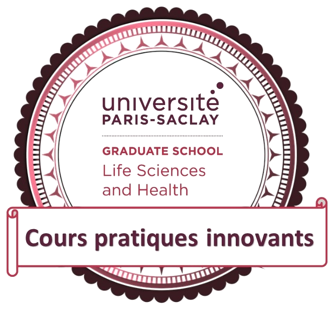
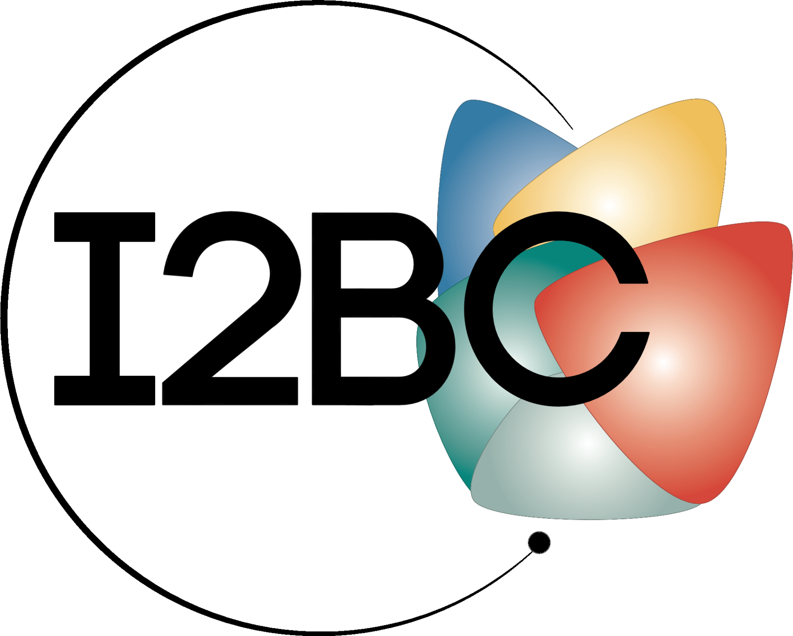
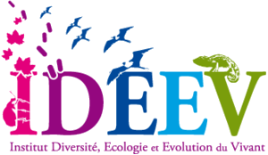

# ChIPseq Workshop

This workshop is part of the [genE²](https://www.gene2.fr/) master of the University Paris-Saclay \

 

\
With the support of : \
\
 \
 \
 

Organized by:\
[Benoit Moindrot](mailto:benoit.moindrot@universite-paris-saclay.fr) and [Pierre Grognet](mailto:pierre.grognet@universite-paris-saclay.fr)

The worshop will take place from the **15th to the 19th of September 2025**

Here is the schedule of the workshop\

## Introduction to Epigenetics and Epigenomics

* [Epigenomics](IntroEPI.md)

## Introduction to ChIP technic

* [ChIP description](ChIP_description.md)

## About *Podospora anserina* and its genome

* [More about *Podospora anserina*](podospora.md)
* [*Podospora anserina*'s genome](genome_podo.md)

## ChIP Protocol 

* [ChIP protocol](ChIP_protocol.md)
* [QuBit protocol](QuBit.md)

## qPCR quantifications

* [qPCR on ChIPed chromatin](qPCR.md)

## Library preparation

* [Library preparation protocol](LibPrep.md)

## Reagents:

* [Reagents](reagents.md)

## Buffers recipes:

* [Lysis buffer](Lysis_Buffer.md)
* [Lysis buffer NaCl](Lysis_Buffer_500.md)  
* [LiCl Washbuffer](LiCl_Buffer.md)  
* [TES](TES.md)
* [Tris-EDTA](Tris_EDTA.md)
* Tris HCl 10 mM
* EGTA 0.5M pH8

## Reports:

* [Information on the reports](report.md)
