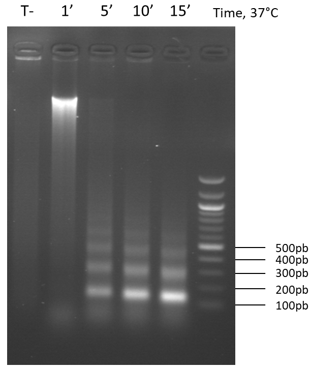

# ChIPseq Workshop

## Reagents:

* [Reagents](reagents.md)

The beads must be washed before use:
> Aliquot the appropriate volume of beads and place on the magntic rack\
  Wash with [Lysis buffer](Lysis_Buffer.md), 1 ml / 250µl of beads, 3 min, at RT\
  Collect the beads and resuspend in [Lysis buffer](Lysis_Buffer.md), same volume as initially\
  Store at 4°c

## Buffers recipes:

* [Lysis buffer](Lysis_Buffer.md)
* [Lysis buffer NaCl](Lysis_Buffer_500.md)  
* [LiCl Washbuffer](LiCl_Buffer.md)  
* [TES](TES.md)

## Protocol

### Preparation of mycelium

Culture
- Inoculate 6 Roux bottles of 100 ml of medium with a fresh mycelium (grown 1 or 2 days on M2 medium at 27°C).
- Incubate 62 hours in the dark at 27°C.

Fixation
- Filter the mycelium on gauze, rinse once with PBS at room temperature.
- Fix in 100ml of PBS 1X + 2.5 ml Formaldehyde 37%, shake 15 min at 27°C. 
- Stop with 2.5 ml of Glycine 2.5 M (shake for 5 min).

Grinding and storage (In cold room)
- Filter the mycelium and wash twice with cold PBS
- Dry on wattman paper (do not hesitate to press the mycelium)
- Grind with liquid nitrogen with mortar and pestle. 
- Weigh and store at -80°C in 50 mL Falcon tubes (transport in liquid nitrogen).

 

### Day 1: 

Lysis and chromatin digestion 

- In the cold room : Weigh approximately 200 mg of mycelium (cool the spatula in liquid nitrogen before each sample, no more than 2 samples after removal of the mycelium from liquid nitrogen)
- In the ice: Resuspend the mycelium with 1 mL of [Lysis buffer](Lysis_Buffer.md) (+proteinase inhibitor + CaCl2)
- Mix well 10 times going back and forth with the P1000, vortex, leave 10 min on ice, vortex again.
- Add 5μl of Micrococcale Nuclease and incubate 20-30 min at 37°C (in the water bath) (+ a control without MNase to check digestion), 
- Gently mix the tubes every 2 min to resuspend the mycelium.
- Stop the reaction with 30 μl of EGTA pH 8 0.5 M , incubate 5 min on ice.

- Centrifuge 3-5 min at 4°C at top speed, 
- Recover the supernatant (= soluble chromatin), 
- Repeat the centrifugation to remove as much as possible the undigested genomic DNA.

(Possibility of Storing -80 ° C at this stage, but for the CHIP it is better to avoid the thawing steps and chain).

Checking the nucleosomal scale (on a 50 µl aliquot):

* Treat with:
 + RNAse A (20mg/ml) 10 μl, 60 min at 37°C
 + Proteinase K (20mg/ml) 10 μl, 120 min at 65°C
 + SDS 0.5% 65°C over night (=decrosslink)
 + Purification  Phenol/ethanol 

### Day 2

 

-          Purif Phenol:

+300μl phenol+300μl of chloroform (mix or vortex, centrifuge 3min speeds max, recover the aqueous phase)

+ 600μl of Chloroform (mix or vortex, centrifuge 3min speeds max recover the aqueous phase)

-          Ethanol precipitation:

+1/100 glycogen

+1/10 Sodium Acetate 3M

+Ethanol 100% x2.5 (DNA+ Na Acetate) or up to the maximum of the tube

Centrifuge 10min 16000G 4°C, remove supernatant

+ 500μl ethanol 70% cold

Centrifuge 10min 16000G 4°C, remove supernatant

Allow to dry on the bench at least 10-20min (until evaporation of the last drops)

Resuspend in 50μl H2O, migrate 10μ+2μ load buffer in small wells, 40min 50V 1.5% agarose

 

 

 

 

 

 

 

For ChiP/Q-PCR:

-          Dose chromatin with Qubit

-          Take 5μg of chromatin supplement up to 1.1ml with Lysis buffer + protease inhibitor, keep the rest to look at the nucleosomal scale

In the cold room:

-          Prewashing add 30μl of magnetic beads incubate 3-4h at 4°C on turntable

-          Remove the balls (3min on magnetic door and then recover the supernatant)

-          Take 100μl (= Input) freeze at -80°C

-          Incubate the rest (1ml) with the antibody over night at 4 ° C on a turntable, do not forget a sample without Antibodies (Ac0)

 

Caution: A Tube (5μg)= Precipitation with an antibody

Provide a tube for each duplicate of each anti-coprs to be tested!

(Possibility of mixing each lyses with each other and then aliquoting before pre-washing)

 

Days 2: Incubation with balls, Washing, Elution and Decrosslink

-          Incubation 20μl of magnetic beads 4h 4 ° C on turntable

-          Washes (magnetic door 3min, remove supernatant and add 1ml of buffer then incubate 10min on turntable each time)

1) 2X Lysis buffer without protease inhibitor without CaCl2
2) Lysis buffer plus 0.5 M NaCl
3) LiCl Wash Buffer (I do it 2x now, to see)
4) Tris-EDTA
-          Elution: resuspend the beads in 62.5μl of TES preheated to 65 ° C and incubate at 65 ° C (vortex every 2min if no thermomixer)

Retrieve the supernatant and then start over (pool the two supernatants)

 

-          Add 500μl of TES to Inputs and Decrosslink Samples and Inputs 65°C over night

 

Days 3: RNase, Proteinase, Phenol/Chlo Purification

-          Add 125μl H2O to samples

-          RNase A treatment 2μl for Samples, 5μl for Input 120min 50 °C

-          Proteinase K treatment (20mg/ml) 10μl 120min 50°C

-          Purif Phenol:

+300μl phenol+300μl of chloroform (mix or vortex, centrifuge 3min speeds max, recover the aqueous phase)

+ 600μl of Chloroform (mix or vortex, centrifuge 3min speeds max recover the aqueous phase)

-          Ethanol precipitation:

+1/100 glycogen

+1/10 Sodium Acetate 3M

+Ethanol 100% x2.5 (DNA+ Na Acetate) or up to the maximum of the tube

Let precipitate over night at -20°C

 

Days 4: Continuation and End ChiP

 

Centrifuge 10min 16000G 4°C, remove supernatant

+ 500μl ethanol 70% cold

Centrifuge 10min 16000G 4°C, remove supernatant

Allow to dry on the bench at least 10-20min (until evaporation of the last drops)

-          Resuspend in 30μl of Tris-EDTA

 

-          Dose chromatin with Qubit high sensitivity

 

-          Freeze at -80°C

 

 

Q-PCR:

Q-PCR mixture per well: 5μl of MasterMix 2μl H2O 1μl of primer mixture 5μM 2μl of diluted DNA

You can test different DNA dilutions to come across the right Cq (20-22) or do like me and test 1/20 which in my opinion corresponded to a good approximation of reality.

In theory the Cq of the Sample should not be different from more than a factor 4 of the Input, but for me I consider that we are OK if we stay in the range (avoid exceeding a Sample>30)

For each pair of primers tested:

-          Make a dilution range of 5 in 5 from a mixed of 1/20 DNA dilutions (Input+Sample), 3 points are enough. This curve makes it possible to determine the effectiveness of your primers and to detect if there are inhibitors.

-          Test an Input 1/20 (normally it's the same for each antibody but you can test them all before selecting one).

-          Test all Samples 1/20 (or adequate dilution)

-          Make 2 wells without DNA = negative controls

-          Make a plate reporter point (Known DNA concentration, always the same pair of antibodies between each plate)

Make each point in triplicat (=9 wells for the efficiency range + 2 neg control wells + 3 Input wells + 3 Sample wells x the number of duplicate ChiP x the number of antibodies tested + 3 reporter wells)

Analysis of the results:

Adjust the Cq of the imput (Imput=1/10 sample)

AdjustedCq= CalculatedCq-(ln(dilution factor)/ln(E))

 

Let CqInput be adjusted= Cq Inputcalculated-( ln(10)/ln(E)) if same dilution for Q-PCR

For each Sample:

%Input= E^(CqInput adjusted-CqSample)