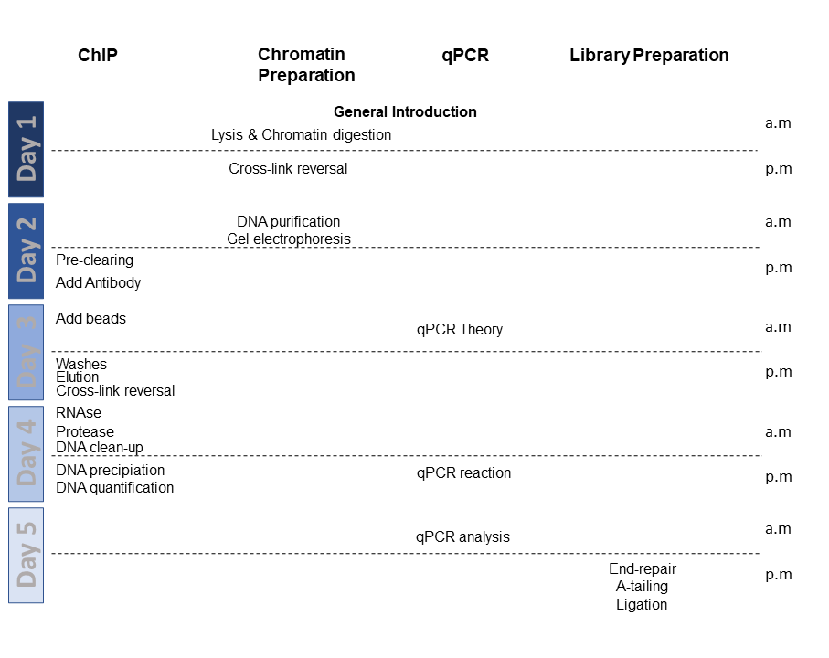

# ChIPseq Workshop

This workshop is part of the genE² master of the University Paris-Saclay\

With the support of:\

Here is the schedule of the workshop\

## ChIP Protocol

* [ChIP protocol](ChIP.md)

## qPCR

* [qPCR on ChIPed chromatin](qPCR.md)

## Library preparation

## Reagents:

* [Reagents](reagents.md)

## Buffers recipes:

* [Lysis buffer](Lysis_Buffer.md)
* [Lysis buffer NaCl](Lysis_Buffer_500.md)  
* [LiCl Washbuffer](LiCl_Buffer.md)  
* [TES](TES.md)