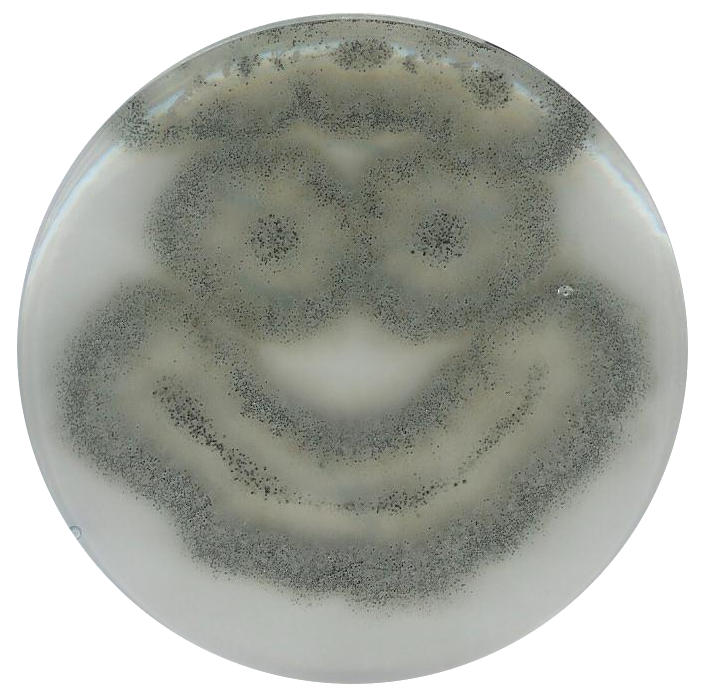

# *Podospora anserina*

Thallus and fructification of *P. anserina* (Credit: P. Grognet)

You can find much more about *P. anserina* in this [book](https://hal.archives-ouvertes.fr/hal-02475488/document)
