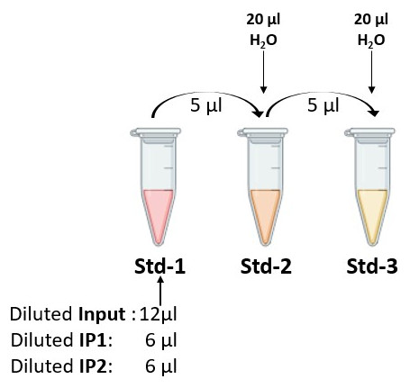

---
output:
  pdf_document: default
  html_document: default
---
# qPCR on ChIPed chromatin

The quality of the immunoprecipitated material is usually evaluated by qPCR before being converted into sequencing library. This is the aim of this section.

## Principle of the analysis: 

The Bio-Rad CFX Real-Time PCR detection system will be used with pairs of primers that have been validated beforehand. All qPCR quantifications are done in triplicates.

Here we will use two pairs of primers:  
>- Pair A :\
Primers FC77 and FC78\
Bind in the middle of Pa_2_11200 CDS, coding for **Actin**  
>- Pair B :\
Primers FC125 and FC126\
Bind in the 5' region of a repressed gene (named Pa_5_80) surrounded with transposable elements

### Calculation of Amplification efficiency = primer efficiency

RAW data (output of CFX analysis software)

* B01/B02/B03, B04/B05/B06 and B07/B08/B09 are standard dilution (1:5 dilution ratio) of a DNA samples (three triplicates)
* Cq is given by the qPCR machine
* Cq Mean is the mean Cq of the three triplicates
* The log (Qty) correspond to the log value of the standard 

Using the RAW data, a standard curve can be plotted and the qPCR amplification efficiency calculated as follows:

### Calculation of "Percent of Input"

The "Percent of Input" is calculted using the Mean Cq value, primer efficiency and Input dilution. This is illustrated below for two primer pairs and 3 different IPs including one with a control GFP antibody.

## Implementation for the practical

### DNA dilution

You can test different DNA dilutions to come across the right Cq (20-22) or do like me and test 1:5 which in my opinion corresponded to a good approximation of reality.

In theory, the Cq of the Samples should not differ from the Input more than a factor of 4, but I consider that we are OK if we stay in that range (avoid exceeding a Sample>30)

### qPCR mix

Prepare a master mix for n+3 reactions (if you have 20 qPCR reaction to do, the mix should be prepared for 23 reactions)

* Each qPCR reaction is assembled as follow: 
    + 5μl of 2X MasterMix 
    + 2μl H2O 
    + 1μl of primer mix 5μM 
    + 2μl of diluted DNA

|<b>Figure -  Samples dilution|
|:--:|
|  |

### qPCR reactions to do

* Beforehand, we need to **quantify primer efficiency** for each primer pair:
    + We need to prepare a "standard" by mixing different DNA as follows:
		- 1 volume of your diluted Input (12µL)
		- 0.5 volume of your diluted IP1 (6µL)
		- 0.5 volume of your diluted IP2 (6µL)
    + Make a serial dilution (1:5) this "standard" (5 µL into 20 µL H2O). 3 different dilutions are enough. *careful*: the acurracy of the serial dilution is essential.
    + These 3 dilutions are referred to as "std-1" (undiluted), "std-2" (1:5 dilution) and "std-3" (1:25 dilution) in the layout for the qPCR. 
    + These PCR are used to determine primer efficiency (see below).

|<b>Figure -  Standards preparation|
|:--:|
|  |

* How many qPCR wells per pair of students:
    + The three **standards**. In triplicates
    + A single **Input** diluted 1/5 (normally it's the same for each antibody but you can test them all before selecting one). In triplicates
    + All your **IP Samples** diluted 1/5 (or adequate dilution). In triplicates
    + Include **two Negative control wells** (i.e. wells in which DNA replaced by H2O)
    + [In some cases, we also need to PCR a **plate reporter point** (Known DNA concentration, always the same pair of primers between each plate) (optional: useful to compare samples on different runs).  We won't need it here.]

* In total, for each primer pair:
	- For the calculation of primer efficiency: 3 x 3 = 9 wells
	- negative controls (H2O): 2 wells
	- For the calculation of "Percent of Input": 3 wells Input + 3 wells IP1 + 3 wells of IP2 = 9 wells.
	- An optional "reporter point" (3 wells)

|<b>Figure -  Layout for the qPCR|
|:--:|
|  |

    

## Analysis of the results:

* Once the RAW data have been exported: Plot measured Cq as a function of the log10(quantity) of the 3 **standards**. This allows to determine qPCR efficiency (see above) and detect the presence of potential PCR inhibitors.

* This and the rest of the analysis can be done using the provided excel file: [Excel file](qPCR_Analysis.xlsx)

Adjust the Cq of the input:\

Adjustment of the Cq_sample :\

Where E stands for the primer efficiency.

Adjustment of the Cq_Input (for the same dilution in qPCR):\

For each Sample:

In addition, you can also calculate the standard deviation for this enrichment with the following formula:

where

**all the formulas will be explained during the workshop**
