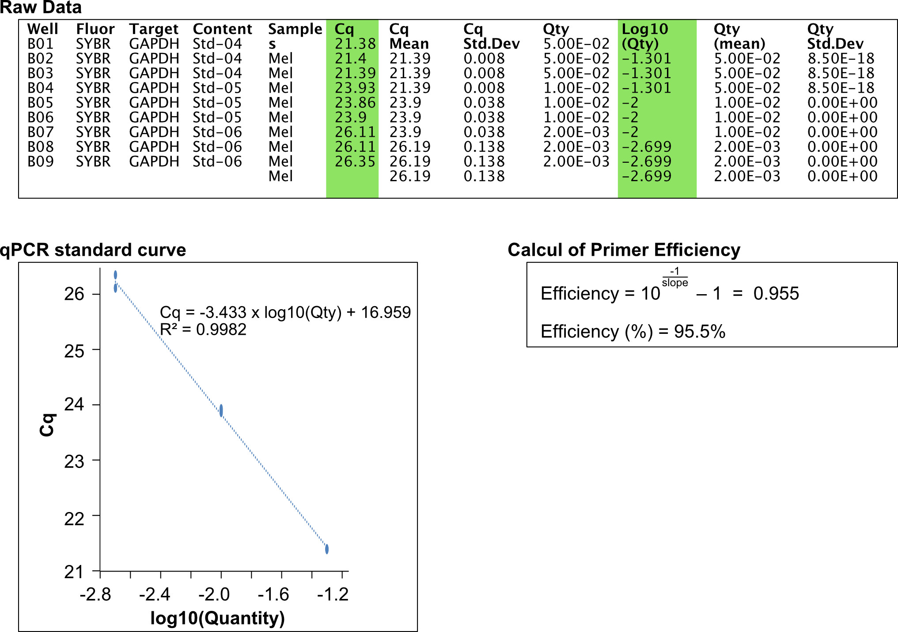
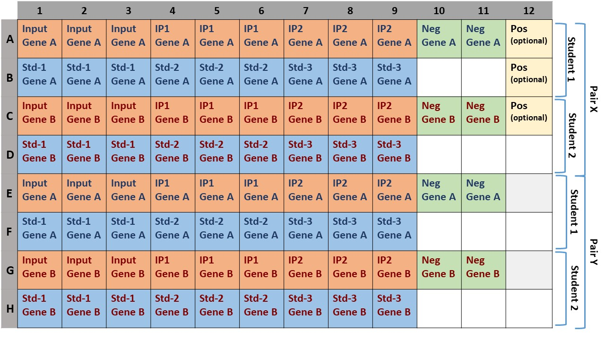
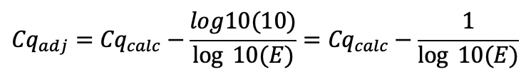

---
output:
  pdf_document: default
  html_document: default
---
# qPCR on ChIPed chromatin

The quality of the immunoprecipitated material is usually evaluated by qPCR before being converted into sequencing library. This is the aim of this section.

## Principle of the analysis: 

The Bio-Rad CFX Real-Time PCR detection system will be used with pairs of primers used in the practicals have been validated beforehand.

All qPCR quantifications are done in triplicates.

### Calculation of Amplification efficiency = primer efficiency

RAW data (output of CFX analysis software)

* B01/B02/B03, B04/B05/B06 and B07/B08/B09 are standard dilution (1:5 dilution ratio) of a DNA samples (three triplicates)
* Cq is given by the qPCR machine
* Cq Mean is the mean Cq of the three triplicates
* The Log10 (Qty) correspond to the log10 value of the standard 

Using the RAW data, a standard curve can be plotted and the qPCR amplification efficiency calculated as follows:

### Calculation of "Percent of Input"

The "Percent of Input" is calculted using the Mean Cq value, primer efficiency and Input dilution. This is illustrated below for two primer pairs and 3 different IPs including one with a control GFP antibody.

## Implementation for the practical

### DNA dilution

You can test different DNA dilutions to come across the right Cq (20-22) or do like me and test 1/20 which in my opinion corresponded to a good approximation of reality.

In theory the Cq of the Sampless should not differ from the Input more than a factor of 4, but I consider that we are OK if we stay in that range (avoid exceeding a Sample>30)

### qPCR mix
Prepare a master mix for n+2 reactions (if you have 10 qPCR reaction to do, the mix should be prepared for 12 reactions)

* qPCR mix: 
    + 5μl of 2X MasterMix 
    + 2μl H2O 
    + 1μl of primer mix 5μM 
    + 2μl of diluted DNA

### qPCR reactions to do

* Beforehand, we need to quantify primer efficiency for each primer pair:
    + Make a serial dilution (1:5) of a mixed of 1/20 DNA dilutions (Input+Sample). 3 different dilutions are enough. Each dilution measured 3 times (= triplicates)
    + *careful*: the acurracy of the serial dilution is essential.
    + Include **two Negative control wells** (i.e. wells in which DNA replaced by H2O)
    + Plot measured Cq as a function of the log10(quantity). This allows to determine qPCR efficiency (see above) and detect the presence of potential PCR inhibitors.
    

* qPCR reactions on the:
    + A single **Input** diluted 1/20 (normally it's the same for each antibody but you can test them all before selecting one). In triplicates
    + All your **IP Samples** diluted 1/20 (or adequate dilution). In triplicates
    + Make a plate **reporter point** (Known DNA concentration, always the same pair of antibodies between each plate) (optional: useful to compare samples on different runs). Ask for details.

* In total, for each primer pair:
	- For the calculation of primer efficiency: 3 x 3 = 9 wells
	- negative controls (H2O): 2 wells
	- For the calculation of "Percent of Input": 3 wells Input + 3 wells IP1 + 3 wells of IP2 = 9 wells.
	- An optional "reporter point" (3 wells)

|<b>Figure -  Protoposition of a layout for the qPCR|
|:--:|
|  |

## Analysis of the results:

The analysis and the different calculation can be done using the provided excel file: [Excel file](qPCR_Analysis.xlsx)

Adjust the Cq of the input:\

Adjustment of the Cq_sample :\

Where E stands for the primer efficiency.

Adjustment of the Cq_Input (for the same dilution in qPCR):\

For each Sample:

In addition, you can also calculate the standard deviation for this enrichment with the following formula:

where

**all the formulas will be explained during the workshop**
