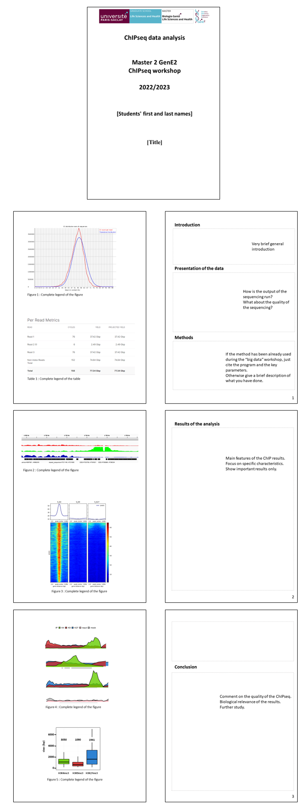

# Reports

## There will be two reports:
- The first one about the wet part, *i.e.* the five day experiments of the workshop
- The second one about the *in silico* analysis of the sequencing

### Writing instructions
  - Write with your own words. 
  - Copy-paste (from websites, existing publications, …) is prohibited (plagiarism). 
  - Cite your sources when needed
  - Avoid sprawling sentences. Instead, adopt concise / efficient / precise / scientific writing (as done in publications).

### Additional instructions
  - one report per two-person team
  - English.
  - A4 page (21 x 29.7 cm)
  - Font for the main text: Arial, 11pt, single-space
  - Margin: 2.5cm (1 inch) on left/right/top/bottom
  - Figures in the main text. With Legend, axis, units, etc…
  - Electronic version (not printed). PDF. Deposited on eCampus.

# First report

The report is due for **Friday, Septembre 30th, 23:59**

### Grade
  This report accounts for **60%** of your grade for the teaching unit

|<b>Overview of the ChIP practical report</b> |
|:--:|
|  |

# Second report

The report is due for **Monday, December 12th, 23:59**

### Grade
  This report accounts for **40%** of your grade for the teaching unit

Below is an outline of what is expected for the report.
The figures are just here to illustrate the outline and not necessarily what we expect.  
The space devoted to each section can also vary.

|<b>Overview of the ChIPseq analysis report</b> |
|:--:|
|  |